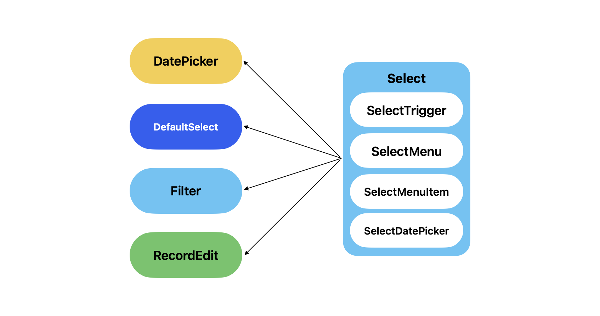

# Buiness Canvas 프론트엔드 과제

Business Canvas 프론트엔드 사전 과제 프로젝트 입니다.

### 설치 및 실행

#### 1. 의존성 패키지 설치

```bash
npm install
```

#### 2. 모드 선택

이 프로젝트는 환경 변수 `STORAGE`를 기반으로 두 가지 데이터 저장 방식을 지원합니다.

- `In-Memory` Mode: 데이터를 메모리에만 저장하며, 새로고침 시 데이터가 초기화됩니다.
- `Local-Storage` Mode: 데이터를 로컬 스토리지에 저장하며, 새로고침 및 브라우저 재시작 시에도 데이터가 유지됩니다.

#### 3. 모드별 실행방법

- `In-Memory` Mode:

```bash
npm run dev:inmemory
```

- `Local-Storage` Mode:

```bash
npm run dev:localstorage
```

### 주요 라이브러리

- React: UI 라이브러리.
- TypeScript: 정적 타입 지원.
- Vite: 빠른 빌드 및 개발 환경 제공.
- styled-components: CSS-in-JS 스타일링.
- @h6s/calendar: Headless 달력 컴포넌트.

### 디렉토리 구조

```plaintext
src/
├── components/ # 재사용 가능한 UI 컴포넌트
│ ├── Modal/
│ ├── Table/
│ ├── Select/
│ ├── Icons/
│ ├── Typography/
│ └── ...
├── hooks/ # 전역 커스텀 훅 관리
├── layouts/ # 페이지 레이아웃
├── pages/ # 페이지 단위 컴포넌트
│ └── MemberList
├── styles/ # 전역 스타일 및 Theme 설정
├── types/ # 주요 타입 정의
├── constants/ # 상수
└── main.tsx # 애플리케이션 진입점
```

### 요구사항 체크리스트

- [x] 레코드 관련

  - [x] 레코드 목록을 테이블 형태로 볼 수 있어야 합니다.
    - [x] 각 필드가 column으로 제공되어야 합니다.
    - [x] 필드별로 filtering 할 수 있어야 합니다.
  - [x] 레코드를 추가할 수 있어야 합니다.
    - [x] 초기 데이터를 제공합니다.
  - [x] 레코드를 수정할 수 있어야 합니다.
    - [x] 레코드 수정시 타입별로 다른 Input을 제공해야 합니다.
  - [x] 레코드를 삭제할 수 있어야 합니다.

- [x] 저장 기능
  - [x] 개발 서버를 시작할 때, `STORAGE` 환경 변수에 따라 데이터를 저장하는 방식을 선택할 수 있어야 합니다.
    - [x] `In-Memory` Mode: 데이터를 메모리에만 저장하며, 새로고침 시 데이터가 초기화됩니다.
    - [x] `Local-Storage` Mode: 데이터를 로컬 스토리지에 저장하며, 새로고침 및 브라우저 재시작 시에도 데이터가 유지됩니다.

### 구현 내용

#### 디자인 시스템

1. **컴파운드 패턴 기반 설계**

- 유연성을 요구하는 컴포넌트의 경우 컴파운드 패턴을 기반으로 설계했습니다. 예를 들어, `Select` 컴포넌트는 `SelectTrigger`, `SelectMenu`, `SelectMenuItem` 등의 하위 컴포넌트로 구성되어 있고, 이를 조합하는 방식으로 다양한 형태의 셀렉트 박스를 구현할 수 있습니다.
- 모든 드롭다운 관련 컴포넌트 (ex. `DatePicker`, `Filter` 등)는 `Select` 컴포넌트를 wrapping하는 형태로 구현되어 재사용성과 확장성을 극대화했습니다.



2. **Polymorphic Component**

- Polymorphic 개념을 적용하여 `as` Props 를 통해 컴포넌트의 렌더링 태그를 유연하게 변경할 수 있도록 설계하였습니다.
- 예를 들어, `SelectTrigger` 컴포넌트는 기본값으로 `button` 태그로 렌더링되지만, `as` Props를 통해 다른 태그 또는 컴포넌트로 변경할 수 있습니다.

```tsx
  // 예시 코드
  <SelectTrigger as={Button}>안녕하세요</SelectTrigger>

  // 위 코드는 아래와 같이 렌더링됩니다.
  <Button>안녕하세요</Button>
```

3. **Design Token 기반**

- `styles/theme.ts` 파일에 디자인 토큰을 정의하고, 이를 통해 최대한 컴포넌트의 스타일을 일관성 있게 관리했습니다.

```tsx
// 예시 코드
const StyledButton = styled.button`
  padding: ${padding.paddingLg};
  background-color: ${color.primary};
  border-radius: ${radius.borderRadiusSm};
  color: ${color.bgContainer};
  transition: ${transition.transition};

  &:hover {
    background-color: ${color.primaryHover};
  }
`;
```

#### Record 관련

1. **Record 타입 설계**

- 기본적으로 `Record`는 유니크한 식별자를 갖는 데이터 객체로 설계되었습니다.

```tsx
export type UniqueRecord = {
  id: string;
} & Record<string, unknown>;
```

2. **RecordEntity 클래스**

- `Record` 데이터를 객체지향적으로 관리하기 위해 `RecordEntity` 클래스를 도입했습니다. 새로운 레코드를 생성할 때, 자동으로 고유한 `id` 를 설정합니다.

```tsx
import { v4 as uuidv4 } from "uuid";

export class RecordEntity {
  id: string;

  constructor(data: Record<string, unknown>) {
    this.id = data.id || uuidv4(); // 고유 ID 자동 생성
    Object.assign(this, data);
  }
}
```

3. **Custom Hook 을 통한 관리**

- `useMemberRecords` 커스텀 훅을 통해 레코드 데이터를 관리합니다. 레코드 데이터를 접근, 생성, 삭제하는 기능을 제공합니다.

```tsx
// 예시 코드
const { records, saveRecord, deleteRecord } = useMemberRecords(initialMembers);
```
